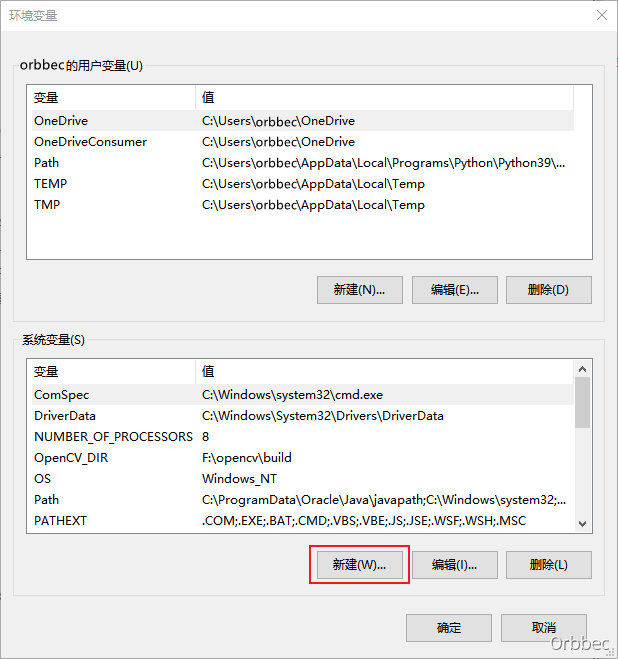
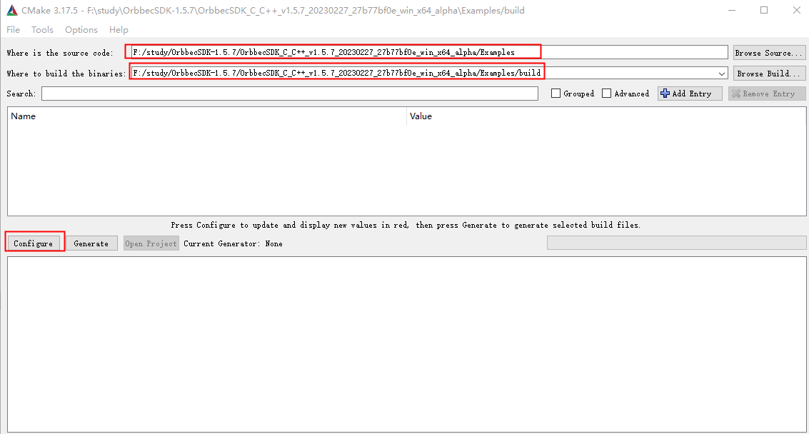
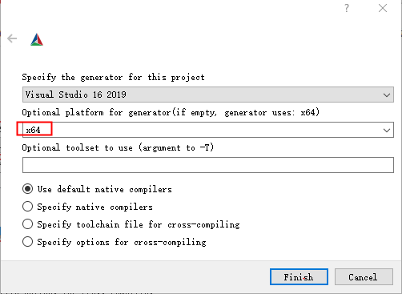
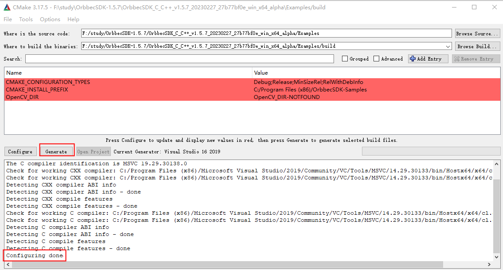
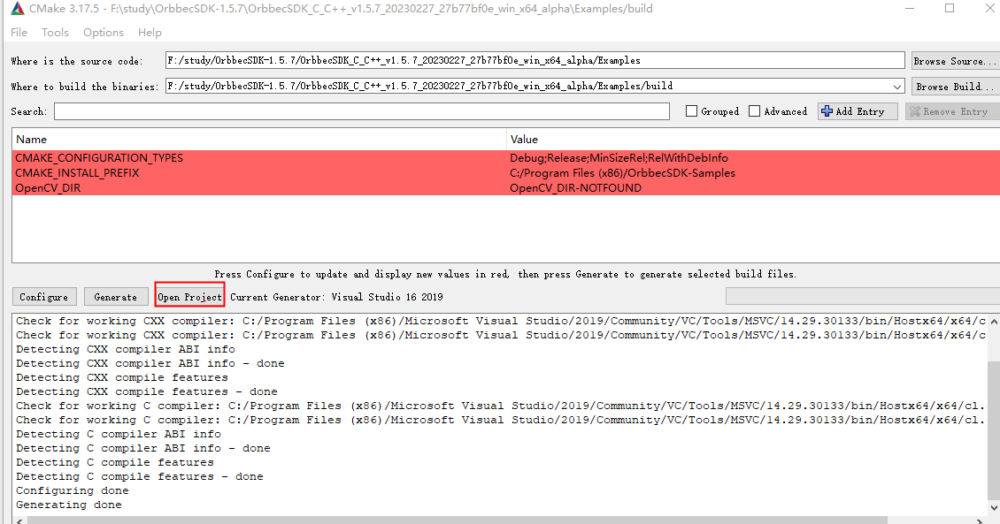
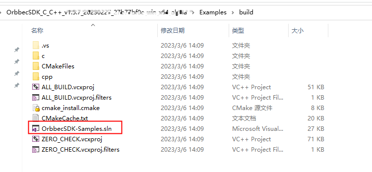
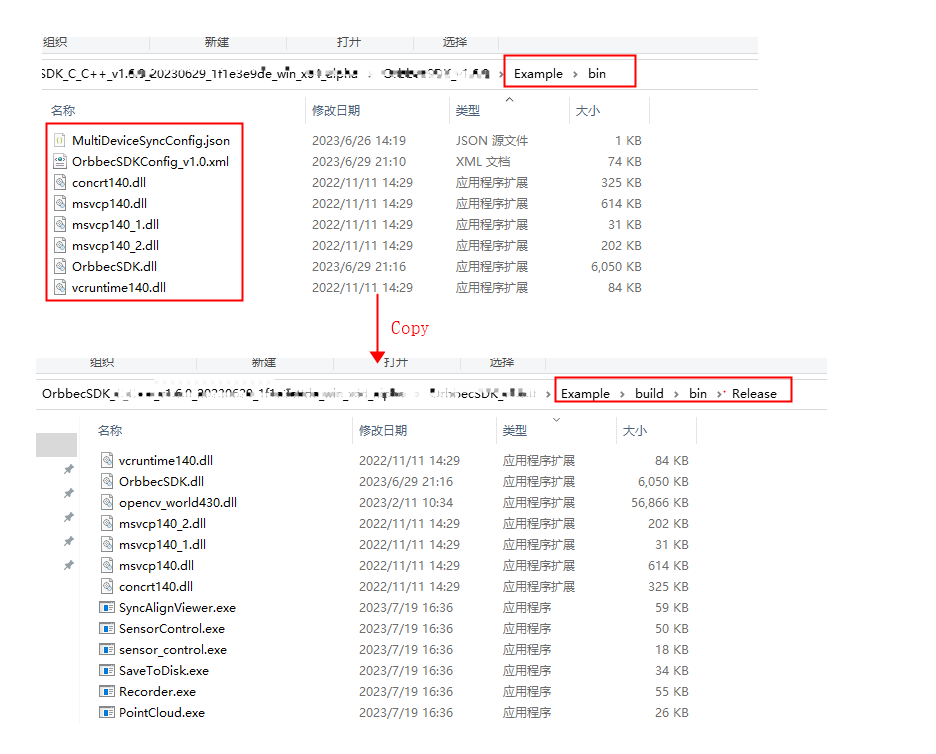
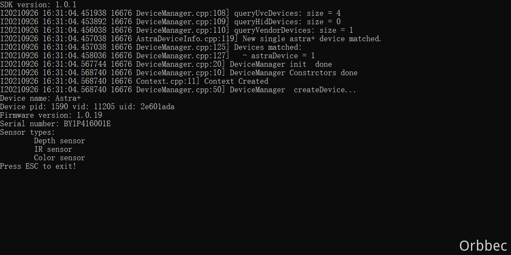

<!-- 本文档面向开发者 -->
# introduction

This document introduces the installation of OrbbecSDK dependencies and the compilation instructions of OrbbecSDK Sample.

# install dependency

The Orbbec SDK is compatible with the standard UVC protocol, and the standard UVC used by Gemini2、Femto 、Femto W、Femto Mega、Astra2、Gemini2 L、Gemini 330 Series device, so no additional drivers are required.

# windows


## 1. Configure OpenCV (Examples dependency)

Data rendering relies on the third-party library OpenCV. Here we take OpenCV 4.3.0 as an example to demonstrate the installation configuration.

* Execute the OpenCV installation file, select the directory where opencv is to be installed, and click extract to execute the installation.


* Add the path of OpenCV in the environment variables of the system, enter OpenCV_DIR for the variable name, pay attention to the capitalization of the letters, and the variable value is the path to the build folder of the OpenCV installation directory.




## 2. metadata(timestamp) registration

Now due to the Windows system mechanism, for UVC protocol devices, if you need to obtain metadata information such as timestamps, you need to first register in the registry. Using obsensor_metadata_win10.md document guide to complete the registry registration.


## 3. Generate your first application

Software dependency: VisualStudio2019, cmake 3.10 and above.

* Download OrbbecSDK software package. Take version 1.5.7 as an example to explain how Windows compiles.

* Open Cmake and set the "Examples" folder as the code path, and the "build" folder under "Examples" as the path to generate the binary file, as shown in the figure below. If there is no build under Examples, you need to create a new folder.




* Click "Configure" and select the corresponding Visual Studio version and platform version, then click "Finish", as shown below:



* Click "Generate", as shown below:



* The Sample project can be opened in the following two ways.

Method 1: With cmake, click the "Open Project" button to open the Visual Studio project.



Method 2: In the folder, directly start the Visual Studio project in Examples/build, as shown in the figure below.



* Open the Examples project interface as shown below:


* Select the project you want to run, right click and "set as startup project", select release and 64-bit version at the run option.


* Connect the device to the host

* Copy the dll files from the bin directory of the Examples folder to the build folder where the generated executables located at.


*  run the HelloOrbbec project



# Linux

## 1. USB access rights configuration

By default, direct access to USB devices in Linux systems requires root privileges, which can be resolved through the rules configuration file. After the files released by OrbbecSDK are decompressed, there will be a "99-obsensor-libusb.rules" configuration file and "install_udev_rules.sh" installation script in the Script directory.


Run the "install_udev_rules.sh" script through the sudo command to complete the rules Installation of configuration files.

``` bash
sudo chmod +x ./install_udev_rules.sh
sudo ./install_udev_rules.sh
 ```

## 2. Increasing the USBFS buffer size (Optional)

By default, the USBFS buffer size is 16 MB. This value is insufficient for high-resolution images or multiple streams and multiple devices usage. User can increase the buffer size to 128 MB.

### Check the USBFS buffer size:

```bash
cat /sys/module/usbcore/parameters/usbfs_memory_mb
```

### Increase the USBFS buffer size until the next reboot (here: example value 128)

``` bash
sudo sh -c 'echo 128 > /sys/module/usbcore/parameters/usbfs_memory_mb'
```

### Increase the USBFS buffer size permanently

To increase the buffer size permanently, add the kernel parameter usbcore.usbfs_memory_mb=128 to the bootloader configuration. How to do this depends on the bootloader on your system.

For GRUB2 (most common):

  1. Open /etc/default/grub. Replace: `GRUB_CMDLINE_LINUX_DEFAULT="quiet splash"` (or other contents within the quotation marks depending on your system) with: `GRUB_CMDLINE_LINUX_DEFAULT="quiet splash usbcore.usbfs_memory_mb=128"`

  2. Update grub

     ``` bash
      sudo update-grub
     ```

  3. reboot your system

Other bootloaders: configure additional kernel parameters of other bootloaders, please see the manual of your bootloader.

## 3. Verify device status

* Environment preparation: ubuntu18.04 x64 desktop

* Take Astra+ as an example, use USB 3.0 Type-C data cable to connect with PC.

* Use the lsusb command to check if the PC system correctly recognizes the camera.


* Judge  whether the camera is recognized normally by PID&VID

```txt
VID: 2bc5 PID: 0536 (color camera)
VID: 2bc5 PID: 0636 (depth camera)
```

## 4. Linux Sample compile

Create a build directory in the Examples directory, as follows:


``` bash
cd build
cmake ..
make
```

